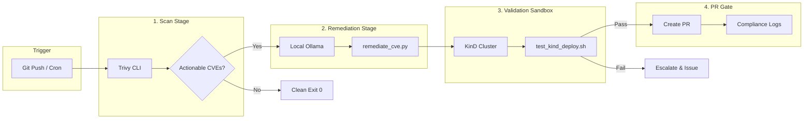

# 🌐 Architecture Explainer: Proactive DevSecOps Supply Chain Guardian

This document serves as the canonical reference for the **Supply Chain Guardian** automated self-healing CI/CD pipeline. Engineered for high-security container workloads, it details the end-to-end flow from vulnerability identification to automated local AI remediation and cluster validation.

---

## 🖼️ Google Cloud Platform Style Architecture Diagram


---

## 🏗️ Deep-Dive: Core Pipeline Lifecycle

The workflow executes as a **closed-loop sequence** composed of five operational gates:



---

## 🧩 Detailed Component Analysis

### 1. The Trigger Engine (GitHub Actions Runner)
* **Responsibility**: Orchestrator of the full runner environment.
* **Mechanism**: Configured to run on code changes to the app directory, or scheduled nightly via cron (to catch newly discovered CVEs on static base images).
* **Guarantees**:
  * Runs in an isolated, ephemeral GitHub Actions runner.
  * No persistent states, preventing lateral pipeline infection.

### 2. The @SecOps Scan Gate (Trivy Security Audit)
* **Responsibility**: Scans base image, dependencies, and OS libraries.
* **Input**: Built baseline container image (`guardian-demo:baseline`).
* **Logic**:
  * Applies policy constraints defined in [`.trivy/trivy.yaml`](file:///d:/abhi/Gikind/.trivy/trivy.yaml).
  * Excludes low-severity or unfixed vulnerabilities (which cannot be patched automatically).
  * Captures CVSS metrics. Any vulnerability with a CVSS score ≥ 9.0 triggers a pipeline warning warning human SREs.
* **Output**: Minimized `trivy-results.json` artifact containing only:
  * `VulnerabilityID`
  * `PkgName`
  * `InstalledVersion`
  * `FixedVersion`

### 3. The @AIPatcher Engine (Local CPU Inference & Patching)
* **Responsibility**: Safely and deterministically updates source code without external network calls.
* **Engine**: Local **Ollama** serving a 4-bit quantized **Llama 3.2 1B** model.
* **Defensive Design Patterns**:
  * **Token Minimization**: Filters and truncates raw JSON data so the 1B model's context window is not saturated.
  * **Zero Token Egress**: Runs completely offline within the runner’s network boundary (no OpenAI/Anthropic/Google external API calls).
  * **Prompt Isolation**: System instructions force the model to output *only* raw Dockerfile primitives inside tag structures.
  * **Regex Sanitizer**: Automatically strips formatting artifacts like backticks (````dockerfile`).
  * **Primitive Verification**: Confirms the patched Dockerfile contains mandatory primitives (`FROM`, `CMD`, or `ENTRYPOINT`).
* **Output**: Atomically updated `Dockerfile` and append-only `patch_audit.log`.

### 4. The @SRE Validation Sandbox (KinD Integration Test)
* **Responsibility**: Proves the AI's patch compiles, boots, and behaves correctly under production constraints.
* **Environment**: A two-node **Kubernetes-in-Docker (KinD)** cluster matching the local workspace config.
* **Operational Stages**:
  1. **Dynamic Image Swap**: Updates deployment tags in [`k8s/deployment.yaml`](file:///d:/abhi/Gikind/k8s/deployment.yaml) from `latest` to `patched`.
  2. **Rollout Verification**: Uses `kubectl wait --for=condition=available` with a 90-second timeout.
  3. **Failed Pod Audit**: Instantly checks for `CrashLoopBackOff`, `OOMKilled`, or `ImagePullBackOff`.
  4. **Active HTTP Probe**: Executes `wget` inside the running container to hit the application's `/healthz` route, proving dependency/libc compatibility.
* **Output**: Detailed `kind-test-report.txt` containing full pod logs and cluster status.

### 5. Post-Patch Verification & PR Submission
* **Responsibility**: Re-verifies security posture and opens a reviewable change request.
* **Flow**:
  1. Re-scans the patched container image.
  2. Confirms that remaining CRITICAL/HIGH vulnerabilities are strictly `0`.
  3. If tests pass, checkout sandbox branch `auto-patcher/cve-remediation` and open/update a GitHub Pull Request using `peter-evans/create-pull-request`.
* **PR Contents**: Full evidence chain linking Trivy scans, Ollama prompt logs, and KinD execution logs for human SRE merge approval.

---

## 🔒 Enterprise Compliance Matrix

| Boundary | Control Mechanism | Target Objective | Status |
|---|---|---|---|
| **Data Privacy** | Local Ollama (`llama3.2:1b`) | No proprietary code or vulnerability data ever leaves the runner. | ✅ Enforced |
| **Run Security** | Non-root Context | Containers run as UID/GID `1000`, `readOnlyRootFilesystem: true`, and dropped capabilities. | ✅ Enforced |
| **Idempotency** | Fixed Git Branch | Re-running checks on existing CVEs updates the same branch, avoiding PR spam. | ✅ Enforced |
| **Traceability** | SOC 2 Artifact Trail | All intermediate files (`trivy-results`, `patch_audit.log`, `kind-test-report`) retained for 90 days. | ✅ Enforced |
| **Escalation** | Automatic Issue Filing | Failed LLM inference or failed KinD boot halts the pipeline and opens a triage issue. | ✅ Enforced |
