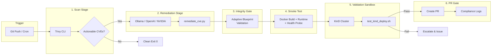

# 🌐 Architecture Explainer: Proactive DevSecOps Supply Chain Guardian

**Version:** 2.0.0
**Last Updated:** 2026-06-18

This document serves as the canonical reference for the **Supply Chain Guardian** automated self-healing CI/CD pipeline. Engineered for high-security container workloads, it details the end-to-end flow from vulnerability identification to automated AI remediation and cluster validation.

---

## 🏗️ Deep-Dive: Core Pipeline Lifecycle

The workflow executes as a **closed-loop sequence** composed of eight operational gates:



---

## 🧩 Detailed Component Analysis

### 1. The Trigger Engine (GitHub Actions Runner)
* **Responsibility**: Orchestrator of the full runner environment.
* **Mechanism**: Configured to run on code changes to the app directory, or scheduled nightly via cron (to catch newly discovered CVEs on static base images).
* **Guarantees**:
  * Runs in an isolated, ephemeral GitHub Actions runner.
  * No persistent states, preventing lateral pipeline infection.

### 2. The @SecOps Scan Gate (Trivy Security Audit)
* **Responsibility**: Scans base image, dependencies, and OS libraries.
* **Input**: Built baseline container image (`guardian-scan:baseline`).
* **Dynamic Build Context**: When the `dockerfile` input contains a path (e.g., `./backend/Dockerfile`), the action automatically derives the build context from `dirname` to support mono-repo layouts without sending the entire repo root to the Docker daemon.
* **Logic**:
  * Applies policy constraints defined in `.trivy/trivy.yaml`.
  * Excludes low-severity or unfixed vulnerabilities (which cannot be patched automatically).
  * Captures CVSS metrics. Any vulnerability with a CVSS score ≥ 9.0 triggers a pipeline warning for human SREs.
* **Output**: Minimized `trivy-results.json` artifact containing only:
  * `VulnerabilityID`
  * `PkgName`
  * `InstalledVersion`
  * `FixedVersion`

### 3. The @AIPatcher Engine (Multi-Provider AI Inference)
* **Responsibility**: Safely and deterministically updates Dockerfiles using AI inference.
* **Providers**: Supports **Ollama** (local, zero-egress), **OpenAI-compatible APIs** (NVIDIA NIM, DeepSeek), or any custom endpoint.
* **Manifest-First Remediation**: The LLM system prompt instructs the model to fix vulnerabilities by pinning OS-level packages (`apk add` / `apt-get install`) rather than injecting inline `npm install` or `pip install` commands that corrupt dependency trees.
* **Defensive Design Patterns**:
  * **Token Minimization**: Filters and truncates raw JSON data so the model's context window is not saturated.
  * **Zero Token Egress** (Ollama mode): Runs completely offline within the runner's network boundary.
  * **Prompt Isolation**: System instructions force the model to output *only* raw Dockerfile primitives.
  * **Regex Sanitizer**: Automatically strips formatting artifacts like backticks (` ```dockerfile `).
  * **Primitive Verification**: Confirms the patched Dockerfile contains mandatory primitives (`FROM`, `CMD`, or `ENTRYPOINT`).
  * **API Key Fallback**: Resolves `api-key` input first, then falls back to `env.API_KEY` from the step/job environment.
* **Output**: Side-by-side `Dockerfile.patched` (original never touched until validated) and append-only `patch_audit.log`.

### 4. The Integrity Gate (Adaptive Blueprint Validation)
* **Responsibility**: Ensures the AI-generated Dockerfile retains all structurally required instructions.
* **Core Mandatory Instructions**: `FROM`, `WORKDIR`, `COPY`, `EXPOSE`, `CMD` — always enforced.
* **Conditional Instructions**:
  * `HEALTHCHECK` — enforced only if the original Dockerfile contained one.
  * `USER` — enforced only when `enforce-non-root` is `true` (default) and the original Dockerfile had a `USER` directive.
* **Policy Preset**: When `policy-preset` is `lax`, the gate warns instead of failing.

### 5. The Smoke Test Gate (Build + Runtime + Health Probe)
* **Responsibility**: Proves the patched Dockerfile compiles, boots, and responds to health checks.
* **Build Gate**: `docker build -f Dockerfile.patched` must succeed.
* **Runtime Stability**: Container must remain running for 15 seconds without crashing.
* **Database Injection**: Dummy environment variables (`MONGO_URI`, `DATABASE_URL`, `SKIP_DB`) are injected into the container to prevent apps with mandatory DB connections from crashing during the stability window.
* **Health Probe**: 5 retries of `curl -sf http://localhost:18080/healthz` with 2-second intervals.

### 6. The @SRE Validation Sandbox (KinD Integration Test)
* **Responsibility**: Proves the AI's patch behaves correctly under production Kubernetes constraints.
* **Environment**: A two-node **Kubernetes-in-Docker (KinD)** cluster matching the local workspace config.
* **Operational Stages**:
  1. **Dynamic Image Swap**: Updates deployment tags in `k8s/deployment.yaml` from `latest` to `patched`.
  2. **Rollout Verification**: Uses `kubectl wait --for=condition=available` with a 120-second timeout.
  3. **Failed Pod Audit**: Instantly checks for `CrashLoopBackOff`, `OOMKilled`, or `ImagePullBackOff`.
  4. **Active HTTP Probe**: Executes health check against the running container's `/healthz` route.
* **Output**: Detailed diagnostics directory (`kind-diagnostics/`) containing pod logs, events, and cluster status.

### 7. Post-Patch Verification & PR Submission
* **Responsibility**: Re-verifies security posture and opens a reviewable change request.
* **Flow**:
  1. Re-scans the patched container image.
  2. Confirms that remaining CRITICAL/HIGH vulnerabilities are strictly `0`.
  3. If tests pass, checks out sandbox branch `auto-patcher/cve-remediation` and opens/updates a GitHub Pull Request using `peter-evans/create-pull-request`.
* **PR Contents**: Full evidence chain linking Trivy scans, LLM prompt logs, and runtime validation logs for human SRE merge approval.

---

## 🔒 Enterprise Compliance Matrix

| Boundary | Control Mechanism | Target Objective | Status |
|---|---|---|---|
| **Data Privacy** | Multi-provider (Ollama local / cloud API) | Local mode: no code leaves the runner. Cloud mode: only Dockerfile + CVE metadata sent. | ✅ Enforced |
| **Run Security** | Configurable `enforce-non-root` input | Containers run as UID/GID `1000`, `readOnlyRootFilesystem: true`, and dropped capabilities. Root allowed when explicitly configured. | ✅ Enforced |
| **Manifest Integrity** | Manifest-first remediation strategy | AI fixes OS-level packages; never injects inline npm/pip install commands. | ✅ Enforced |
| **Runtime Stability** | Smoke test DB injection | Dummy `MONGO_URI` / `DATABASE_URL` / `SKIP_DB` prevent DB-dependent apps from crashing during validation. | ✅ Enforced |
| **Idempotency** | Fixed Git Branch | Re-running checks on existing CVEs updates the same branch, avoiding PR spam. | ✅ Enforced |
| **Traceability** | SOC 2 Artifact Trail | All intermediate files (`trivy-results`, `patch_audit.log`, `kind-diagnostics`) retained for 90 days. | ✅ Enforced |
| **Escalation** | Automatic Issue Filing | Failed LLM inference or failed KinD boot halts the pipeline and opens a triage issue. | ✅ Enforced |
